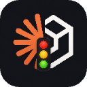
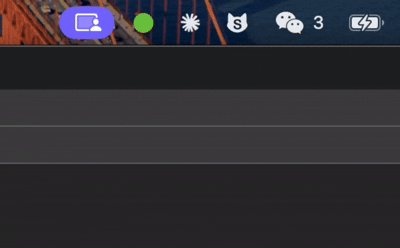

<div align="center">
  

  # Code Light AI

  AI 编程助手的系统托盘状态指示灯

  [English](./README.md)

  
</div>

让你一眼就能看到 AI 编程助手正在做什么 —— 不需要一直盯着终端窗口。

目前支持 **[Claude Code](https://docs.anthropic.com/en/docs/claude-code)** 和 **[OpenAI Codex CLI](https://github.com/openai/codex)**。

## 状态指示灯

| 颜色 | 状态 | 说明 |
|:---:|---|---|
| 灰色 | 空闲 | 没有活跃会话 |
| 绿色（闪烁） | 工作中 | Agent 正在执行工具调用 |
| 黄色（闪烁） | 等待确认 | Agent 正在等待用户授权确认 |
| 红色（闪烁） | 出错 | 发生了错误 |
| 蓝色 | 已完成 | 任务完成（显示 10 秒后自动回到空闲状态） |

活跃状态（工作 / 等待 / 出错）每 500ms 闪烁一次，提醒你注意。托盘图标的提示文字会显示当前状态、活跃会话数和最后更新时间。

## 工作原理

Code Light 使用基于文件的轮询机制：

1. **Shell 脚本**作为生命周期钩子注册到 Claude Code（`~/.claude/settings.json`）和 Codex（`~/.codex/hooks.json`）
2. 每个钩子将 JSON 状态文件写入 `~/.code-light/sessions/<会话ID>.json`
3. 托盘应用每秒轮询这些文件，并更新图标

```
Agent 事件 → 钩子脚本 → ~/.code-light/sessions/*.json → 托盘图标
```

零网络端口、零 API、零配置 —— 只依赖磁盘文件。

## 安装

### 前提条件

- macOS 12+ / Linux / Windows 10+
- 已安装 [Claude Code CLI](https://docs.anthropic.com/en/docs/claude-code) 和/或 [Codex CLI](https://github.com/openai/codex)
- Node.js 18+ 和 [pnpm](https://pnpm.io/)
- [Rust](https://rustup.rs/) 工具链
- Windows 用户需安装 [Git for Windows](https://git-scm.com/)（提供 bash 环境）

### 从源码构建

```bash
git clone https://github.com/cuihuapeng/code-light-ai.git
cd code-light-ai
pnpm install
pnpm tauri build
```

构建产物：

| 平台 | 路径 |
|------|------|
| macOS | `src-tauri/target/release/bundle/macos/Code Light.app` |
| Linux | `src-tauri/target/release/bundle/deb/code-light_*.deb` |
| Windows | `src-tauri/target/release/bundle/nsis/code-light_*.exe` |

## 使用方法

1. **启动** Code Light —— 系统托盘会出现一个灰色圆点
2. **右键点击**图标，选择 **"Setup Claude Hooks"** 注册 Claude Code 钩子，或选择 **"Setup Codex Hooks"** 注册 Codex 钩子
3. **在终端启动你的 AI Agent** —— 托盘图标会随着 Agent 的工作自动变色

就这么简单。在 macOS 上应用以纯菜单栏方式运行，不会出现在 Dock 栏。

> **Codex 用户注意：** 设置 Codex Hooks 后，需要在 Codex CLI 中运行 `/hooks` 命令，然后按 `t` 信任所有钩子，钩子才会生效。

### macOS 提示"已损坏"或"无法打开"

从源码构建或下载未签名版本时，macOS 可能会阻止打开。解决方法：

```bash
xattr -cr /path/to/Code\ Light.app
```

然后**右键点击**应用，选择**打开** → 再次点击**打开**即可。只需操作一次。

### 多会话支持

如果你在不同终端同时运行多个会话（Claude Code 和/或 Codex），Code Light 会同时追踪所有会话。图标显示所有活跃会话中优先级最高的状态（错误 > 等待 > 工作 > 完成 > 空闲）。

### 自动清理

- 5 分钟内无活动的会话自动移除
- "等待"状态超过 30 秒自动提升为"工作"
- "工作"状态超过 60 秒自动标记为"完成"
- "完成"状态在 10 秒显示窗口后自动清理

## 开发

```bash
# 安装依赖
pnpm install

# 开发模式运行
pnpm tauri dev

# 生产构建
pnpm tauri build

# Rust 代码检查
cd src-tauri && cargo clippy
```

## 项目结构

```
code-light/
├── hooks/
│   ├── claude/                      # Claude Code 钩子脚本
│   │   ├── _helpers.sh              # 公共函数（环境变量获取会话 ID、原子写入）
│   │   ├── pre-tool-use.sh          # → 工作中
│   │   ├── post-tool-use.sh         # 占位
│   │   ├── post-tool-use-failure.sh # → 出错
│   │   ├── notification.sh          # → 等待确认（权限提示时）
│   │   └── stop.sh                  # → 已完成
│   └── codex/                       # Codex CLI 钩子脚本
│       ├── _helpers.sh              # 公共函数（从 stdin JSON 提取会话 ID）
│       ├── session_start.sh         # → 工作中
│       ├── pre_tool_use.sh          # → 工作中
│       ├── permission_request.sh    # → 等待确认
│       ├── post_tool_use.sh         # → 工作中
│       ├── user_prompt_submit.sh    # → 工作中
│       └── stop.sh                  # → 已完成
├── src-tauri/                       # Tauri v2 / Rust 后端
│   ├── src/
│   │   ├── main.rs                  # 入口
│   │   └── lib.rs                   # 托盘图标、轮询、闪烁、钩子注册
│   ├── icons/status/                # 状态指示灯图标（灰、绿、黄、红、蓝）
│   └── tauri.conf.json              # Tauri 配置
├── src/                             # 前端（无可见窗口，仅占位）
├── package.json
└── vite.config.ts
```

## 支持的 Agent 与事件

| 事件 | Claude Code | Codex CLI |
|------|:-----------:|:---------:|
| 会话启动 | - | 工作中 |
| 工具调用前 | 工作中 | 工作中 |
| 权限 / 通知 | 等待确认 | 等待确认 |
| 工具调用后 | - | 工作中 |
| 工具调用失败 | 出错 | - |
| 用户提交提示 | - | 工作中 |
| 会话结束 | 已完成 | 已完成 |

## 技术栈

- **后端：** [Tauri v2](https://v2.tauri.app/) + Rust
- **前端：** Vite + TypeScript（最小化 —— 应用没有可见窗口）
- **钩子：** Bash 脚本，注册为生命周期钩子

## 许可证

MIT
